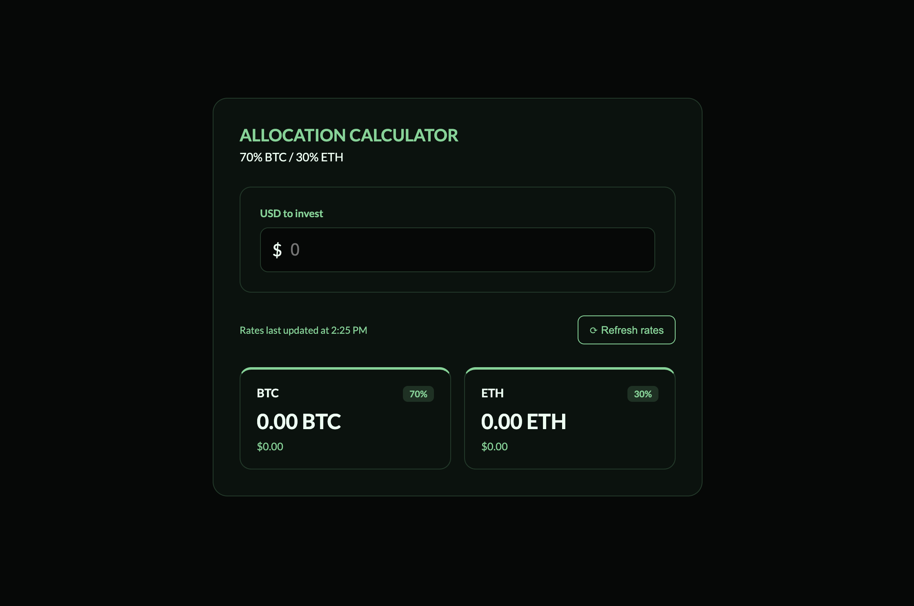

# Asset Allocation Calculator

A small web app that takes a USD amount and calculates a 70/30 BTC/ETH split using live rates from the Coinbase API.

<kbd>
    
</kbd>

## Built With

Vue 3, TypeScript, Vite

## Getting Started

To run locally, run the following:

```
npm install
npm run dev
```

and open the `localhost` link shared by vite in the terminal.

## How it works

- A user enters a USD amount to invest
- The app calculates the crypto split based on exchanges rates from Coinbase
- A refresh button allows users to get the most up-to-date rate, anytime.

## Future features

In the scenario that this project develops further, I would add:

- Editable percentages so users can customize the ratio
- Support for additional cryptocurrencies pulled from the Coinbase API
